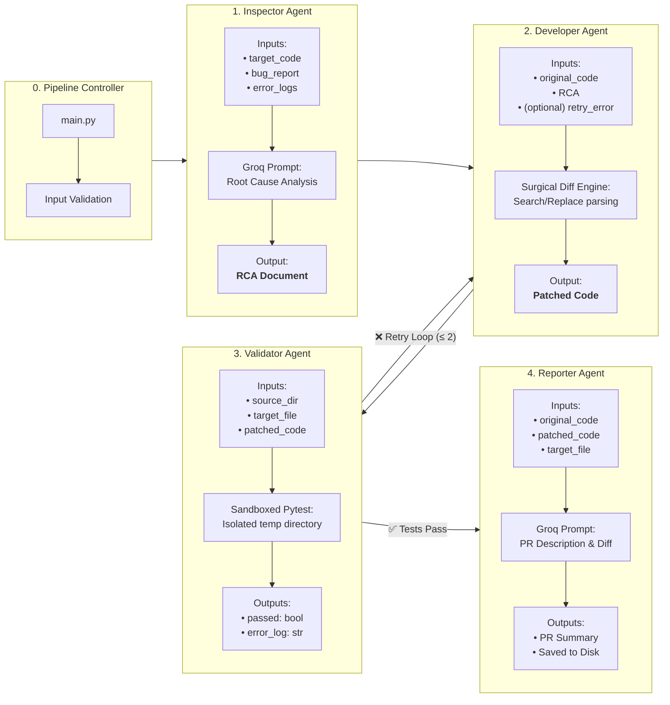

# Multi-Agent Workflow Specification 🤖

This document provides a detailed breakdown of the internal workflow, lifecycle state transitions, data exchange protocols, and decision loops across the four autonomous agents.

---

## 🔄 Agent Workflow & Lifecycle Diagram

```mermaid
stateDiagram-v2
    [*] --> Ingestion: CLI / Interactive Invocation

    state Ingestion {
        [*] --> LoadEnv: Load GROQ_API_KEY from .env
        LoadEnv --> ReadTarget: Read Target Source File
        ReadTarget --> ParseInputs: Ingest Bug Description & Traceback
        ParseInputs --> [*]
    }

    Ingestion --> Phase1_Inspection: Pass Code + Bug Report + Error Logs

    state Phase1_Inspection {
        [*] --> PromptInspector: Synthesize RCA Prompt
        PromptInspector --> QueryGroq_RCA: Call Groq API (gpt-oss-120b)
        QueryGroq_RCA --> ParseRCA: Extract Root Cause Analysis
        ParseRCA --> [*]
    }

    Phase1_Inspection --> Phase2_Development: Pass RCA + Original Code

    state Phase2_Development {
        [*] --> FormatPrompt: Construct System & Developer Prompt
        FormatPrompt --> QueryGroq_Dev: Call Groq API
        QueryGroq_Dev --> ParseBlocks: Extract <<<< SEARCH ==== REPLACE >>>>
        ParseBlocks --> ApplyDiff: In-Memory Patch Application
        ApplyDiff --> [*]
    }

    Phase2_Development --> Phase3_Validation: Candidate Patched Code

    state Phase3_Validation {
        [*] --> CreateSandbox: tempfile.mkdtemp()
        CreateSandbox --> CopyWorkspace: shutil.copytree(source_dir)
        CopyWorkspace --> InjectPatch: Overwrite target file in sandbox
        InjectPatch --> ExecutePytest: subprocess.run(['pytest'], env=PYTHONPATH)
        ExecutePytest --> EvaluateResult: Check returncode == 0
        EvaluateResult --> CleanupSandbox: shutil.rmtree(temp_dir)
        CleanupSandbox --> [*]
    }

    state RetryDecision <<choice>>
    Phase3_Validation --> RetryDecision: Evaluate Outcome

    RetryDecision --> Phase2_Development: ❌ Tests Failed & Retry < 2<br/>(Inject pytest error trace into prompt)
    RetryDecision --> Phase4_Reporting: ✅ Tests Passed
    RetryDecision --> Aborted: ⚠️ Retry limit reached (2 retries exhausted)

    state Phase4_Reporting {
        [*] --> PromptReporter: Synthesize PR Diff & Summary Prompt
        PromptReporter --> QueryGroq_Rep: Call Groq API
        QueryGroq_Rep --> FormatPR: Generate Markdown Summary & Unified Diff
        FormatPR --> ApplyToDisk: Write verified code to original target file
        ApplyToDisk --> [*]
    }

    Phase4_Reporting --> Completed: Success! (Target fixed & documented)
    Completed --> [*]
    Aborted --> [*]
```

---

## 📊 Detailed Agent-by-Agent Workflow

---

## 📋 Data Exchange & Schema Protocol

Between each phase, agents exchange strictly defined data artifacts:

| Step | Sender | Receiver | Payload / Data Structure | Purpose |
| :--- | :--- | :--- | :--- | :--- |
| **1** | `main.py` | `InspectorAgent` | `bug_report: str`, `error_log: str`, `original_code: str` | Initial problem statement & source code |
| **2** | `InspectorAgent` | `DeveloperAgent` | `rca: str`, `original_code: str` | Pinpointed lines and technical explanation of root cause |
| **3** | `DeveloperAgent` | `ValidatorAgent` | `patched_code: str` | Candidate code containing applied SEARCH/REPLACE blocks |
| **4** | `ValidatorAgent` | `DeveloperAgent` *(on failure)* | `context_rca += "\nPrevious fix failed with: " + current_error` | Iterative retry feedback with exact pytest trace |
| **5** | `ValidatorAgent` | `ReporterAgent` *(on success)* | `passed == True`, `patched_code: str` | Confirmation that all tests passed green |
| **6** | `ReporterAgent` | `User / Disk` | `report: str`, writes to disk at `target_path` | Markdown PR overview and updated production file |

---

## 🛡️ Failure Handling & Self-Healing Policies

1. **Model Fallback**:
   - Primary: `openai/gpt-oss-120b` (robust reasoning for RCA and surgical patching).
   - Fallback: `qwen/qwen3.8-27b` and `openai/gpt-oss-20b` if primary experiences rate-limits or timeouts.
2. **Search/Replace Block Fault Tolerance**:
   - If the Developer Agent returns markdown codeblocks instead of search/replace tags, `DeveloperAgent._apply_blocks()` contains a regex fallback parser to extract raw python code cleanly.
3. **Sandbox Isolation**:
   - Any side effects or broken dependencies generated during validation are discarded when `Sandbox.cleanup()` deletes the temporary directory.
   - The original code is **only** overwritten once `pytest` passes with exit code `0`.
