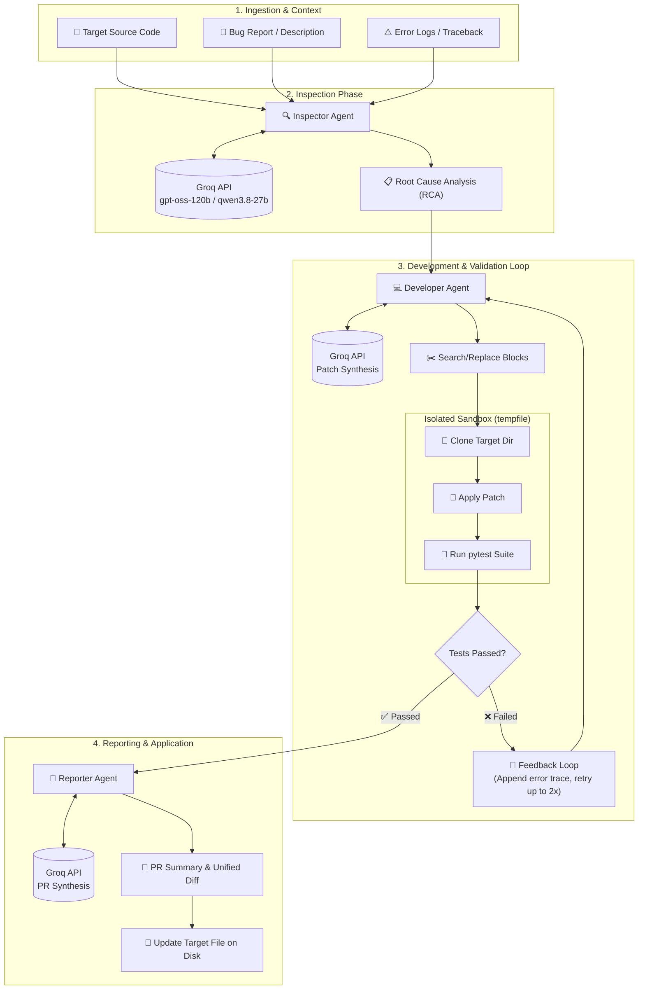
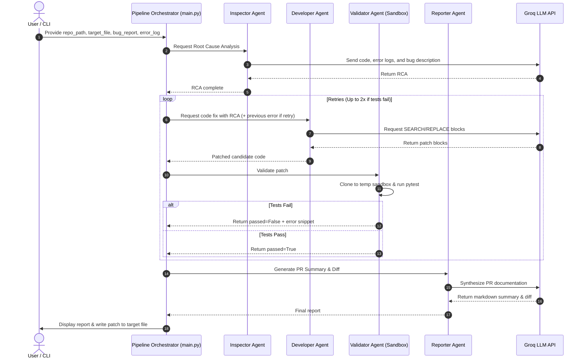

# Autonomous AI Bug Fixing Pipeline — Architecture 🏗️

This document details the multi-agent design, component interactions, and execution flow of the **Autonomous AI Bug Fixing Pipeline**.

> 💡 For the step-by-step lifecycle state machine and data exchange protocols, see [AGENT_WORKFLOW.md](AGENT_WORKFLOW.md).

---

## 📊 High-Level Architecture Diagram



---

## 🧩 Agent Roles & Responsibilities

### 1. 🔍 Inspector Agent (`agents/inspector.py`)
- **Input**: Bug report, error logs/traceback, and original target source code.
- **Role**: Performs systematic Root Cause Analysis (RCA). Identifies specifically which functions, logic blocks, or boundary conditions are failing and explains the technical reason for the failure.
- **Output**: Detailed Root Cause Analysis (RCA) document passed to the Developer Agent.

### 2. 💻 Developer Agent (`agents/developer.py`)
- **Input**: RCA from the Inspector Agent, plus failure feedback from previous validation attempts (if any).
- **Role**: Synthesizes surgical code modifications without hallucinating or rewriting unchanged parts of the file.
- **Mechanism**: Enforces exact `SEARCH/REPLACE` blocks:
  ```text
  <<<<
  [exact lines from original code]
  ====
  [new replacement lines]
  >>>>
  ```
- **Output**: Patch representation that can be reliably mapped and applied onto the target file.

### 3. 🧪 Validator Agent (`agents/validator.py` & `utils/sandbox.py`)
- **Input**: Source directory, relative file path, and candidate patch.
- **Role**: Validates fixes in complete isolation before modifying the actual working tree.
- **Mechanism**:
  1. Creates an isolated temporary directory via Python's `tempfile.mkdtemp()`.
  2. Copies target project files into the sandbox.
  3. Applies the candidate patch to the sandboxed file.
  4. Configures `PYTHONPATH` and runs `pytest`.
  5. Tears down and cleans up sandbox resources (`shutil.rmtree`).
- **Feedback Loop**: If tests fail, captures the standard error / failure output and routes it back to the Developer Agent for iterative correction (up to 2 automatic retries).

### 4. 📝 Reporter Agent (`agents/reporter.py`)
- **Input**: Original code, final passing code, and target filename.
- **Role**: Generates a clean Pull Request summary containing:
  - High-level explanation of the bug and fix.
  - Standard unified git diff (`--- a/... +++ b/...`).
- **Disk Persistence**: Once verified, commits the validated patch directly to the target file on disk.

---

## 🔄 Execution Sequence



---

## ⚡ Key Architectural Advantages

- **Zero Full-File Rewrites**: Search/Replace patching prevents LLMs from hallucinating imports, dropping existing methods, or modifying formatting outside the bug scope.
- **Isolated Sandboxing**: Prevents broken patches from polluting the local workspace or triggering regressions until tests demonstrably pass.
- **Autonomous Feedback Loop**: If the LLM's first fix contains an edge-case failure, the raw pytest failure trace is immediately fed back into context for self-correction.
- **Fast Inference**: Powered by ultra-low-latency Groq LPUs (`openai/gpt-oss-120b` and `qwen/qwen3.8-27b`).
