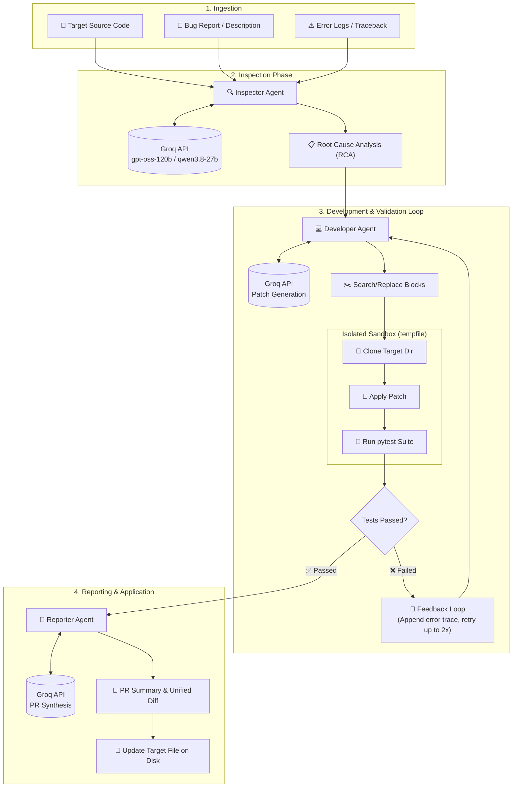

# Autonomous AI Bug Fixing Pipeline 🚀

This is a multi-agent AI coding pipeline that automatically ingests a bug report and error log, finds the root cause, generates a patch, validates it in an isolated sandbox, and outputs a clean Git diff.

It fulfills all the core requirements of an automated bug-fixing system:
1. **Multi-agent architecture:** (Inspector, Developer, Validator, Reporter).
2. **LLM Powered:** Uses the Groq API (`openai/gpt-oss-120b` / `qwen/qwen3.8-27b`) for rapid, reliable code reasoning and repair.
3. **Diff-based Patching:** Modifies code surgically using Search/Replace blocks instead of replacing entire files, which minimizes hallucinations.
4. **Isolated Sandboxing:** Runs `pytest` automated validations in isolated temporary directories.
5. **Interactive & CLI Support:** Run via command line arguments or interactive prompts with built-in demo defaults.

## 🏗️ System Architecture



## ⚙️ Setup

1. Clone the repository:
   ```bash
   git clone https://github.com/PriyanshuBaadlas/Autonomous-AI-Bug-Fixer.git
   cd Autonomous-AI-Bug-Fixer
   ```
2. Install dependencies:
   ```bash
   pip install -r requirements.txt
   ```
3. Configure your API key in `.env`:
   Open the included `.env` file and replace the placeholder with your Groq API key:
   ```env
   GROQ_API_KEY="gsk_your_actual_key_here"
   ```
   *(Optional: You can also specify `GROQ_MODEL` to override the default model).*

## 🧪 Demo Scenario: E-Commerce Order Processor

The repository includes a realistic target package under [`demo_target/`](demo_target):
- **`demo_target/order_processor.py`**: An e-commerce pricing engine supporting customer tiers (`STANDARD`, `VIP`, `PLATINUM`), percentage/fixed coupons, state sales taxes, and shipping rules.
- **The Bug**: Sales tax is computed against the gross subtotal instead of the net discounted taxable amount.
- **`demo_target/test_order_processor.py`**: A 7-test suite with assertions validating correct discounting and tax.

## 🚀 Usage

### Option 1: Interactive Mode (Simplest)
Simply execute `main.py` and press **Enter** through the prompts to automatically run the included demo:
```bash
python main.py
```

### Option 2: CLI Mode

**Linux / macOS (Bash):**
```bash
python main.py \
  --repo_path "demo_target" \
  --target_file "order_processor.py" \
  --bug_report "When an order has customer tier discounts or coupons applied, the sales tax is incorrectly calculated on the gross subtotal instead of the net discounted taxable amount in process_order, resulting in customers being overcharged." \
  --error_log "AssertionError: assert 8.25 == 7.43 where 8.25 = OrderInvoice(...).tax"
```

**Windows (PowerShell):**
```powershell
python main.py `
  --repo_path "demo_target" `
  --target_file "order_processor.py" `
  --bug_report "When an order has customer tier discounts or coupons applied, the sales tax is incorrectly calculated on the gross subtotal instead of the net discounted taxable amount in process_order, resulting in customers being overcharged." `
  --error_log "AssertionError: assert 8.25 == 7.43 where 8.25 = OrderInvoice(...).tax"
```

## 🧩 How it works

1. **🔍 Inspector Agent**: Analyzes the bug report, error logs, and target source code to identify the exact root cause.
2. **💻 Developer Agent**: Outputs concise `SEARCH/REPLACE` blocks to surgically patch the code without full-file hallucinations.
3. **🧪 Validator Agent**: Sandboxes the project in an isolated temp environment, applies the patch, configures `PYTHONPATH`, and executes `pytest`. If tests fail, the stderr output is automatically fed back to the Developer Agent for iterative correction.
4. **📝 Reporter Agent**: Once tests pass, it generates a comprehensive Pull Request summary with unified diff and applies the patch to the target.
